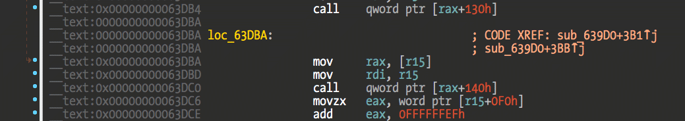

### Intro

 GiveMeHex  
 by fG! - reverser@put.as - https://reverse.put.as  
 in the great covid year of 2021  
 No rights reserved.  

 This software is fuck off licensed.  
 Just fuck off and do whatever you want with it.  
 It's public domain.  
 
 Greetz to:
 - Portuguese Covid Vaccination Task Force  
 You girls and boys rock! Outstanding job!

 - NSO, Candiru, Zerodium, Gamma Group, Ability, DarkMatter, Intellexa, Verint, Circles  
 Keep hacking the Cupertino clowns! Love ya!!!
```
        (¯`v´¯)♥
         •.¸.•´
      ¸.•´
     (
   ☻/
  /▌♥♥
  / \ ♥♥
``` 
 Fuckz to:
 - HexRays
 - HackingTeam
 - Covid
 
 Happy Birthday to put.as, 18 years old already!

### About

This is a quick IDA hack to add a 0x prefix to disassembly view addresses.  
Because I'm damn tired of having to type it everytime I copy one address to lldb or a calculator.  
Been annoying me for years and I decided to do something about it today.  



### How

The easiest way is to load a UI plugin with a breakpoint trap. Doing a backtrace when the breakpoint is hit will give us the `libida64.dylib` address that called the plugin.

Now disassemble `libida64.dylib` and look at backtraced address. There should be a jump/branch to a register which contains the plugin address. 

The `get_user_defined_prefix` hook/callback prototype is:

```c
  // Get a user-defined prefix.
  /// This callback must be overridden by the derived class.
  /// \param out      the output buffer
  /// \param ea       the current address
  /// \param insn     the current instruction. if the current item is not
  ///                 an instruction, then insn.itype is zero.
  /// \param indent   see explanations for \ref gen_printf()
  /// \param line     the line to be generated.
  ///                 the line usually contains color tags.
  ///                 this argument can be examined to decide
  ///                 whether to generate the prefix.
  virtual void idaapi get_user_defined_prefix(
        qstring *vout,
        ea_t ea,
        const class insn_t &insn,
        int lnnum,
        int indent,
        const char *line) = 0;
};
```

The first argument to the jump/branch is the `this` pointer in RDI/X0. We are interested in the second argument, `ea`. It is obtained from the class pointer that we are looking for. 

For IDA 7.7 ARM64 we have the following code:

```
__text:00000000000281EC                 LDR             X2, [X19,#8]
```

What we need is the value of register X19. Looking at the code before this we can observe that this register isn't modified so it's safe for us to retrieve its content and assume it is the class pointer we are looking for.

The `ORIGINAL_STRING_OFFSET` is the offset to the string we need. It can be found at the beginning of this function or via a debugger. It seems to hold constant between version (I'd assume this is a stable structure). If IDA starts crashing it's probably because of this or a bad class pointer due to changes in registers.

Basically the hook will append whatever string we create in our hook to the original autogenerated address string.

We have no direct access inside our hook to this string. But looking at the disassembly address we can observe that `RBX`/`X19` register holds the class pointer where the pointer to the autogenerated string is. So we just retrieve this string and modify it directly, and then let IDA do the rest of the work for us. 

Quite hacky and could be done better. Maybe there's a official way to achieve this but asking a simple question on Twitter is understood as scamming IDA support (or whatever) and I'm too lazy to open a support email about this.

**We are reverse engineers! Why write an email if we can hack the binary?**

### Build

Edit the Makefile to configure correct paths to your case and then just execute `make`. Use `make install` to install the plugin or copy by hand.

Tested only against IDA 7.6SP1/7.7 macOS version (x64 and ARM64). Might blow up your Windows or Linux version if you dare!

No fat binary is built, only for whatever native arch where its being compiled at.

### Problems

Since it's just hacking the original string it will have issues with high addresses such as XNU kernel.

A better hack would be to extend the original string. For example, add a two bytes empty string in our hook, and then we have enough space to add "0x" to that new string. Too much work for a Friday night, and I just wanted a quick solution that works with my current target.

Just go nag HexRays support for a real solution :-)

### Epilogue

Have fun!  
fG!
